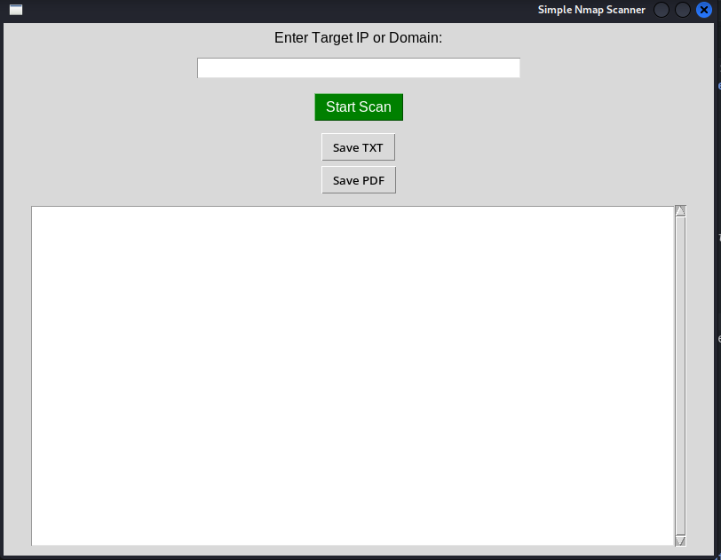
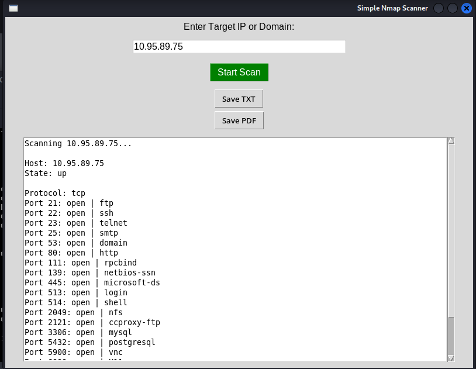

# Simple Nmap GUI Scanner (Python)

A lightweight and easy-to-use graphical Nmap scanner built with **Python + Tkinter**.

This tool provides a simple interface to scan hosts, detect open ports, identify services, and export results — without using the terminal.


## Features

- Simple and clean GUI  
- Fast Nmap scan (`-T4 -F`)  
- Scan IP address or domain  
- Shows host status  
- Displays open ports and services  
- Save scan results as TXT  
- Export report as PDF  
- Multithreaded (UI stays responsive)  
- Beginner-friendly  


## Screenshots

### Initial Interface (No Target Entered)

<p align="center">
  
</p>

### Scan Result (With Output)

<p align="center">
  
</p>


## Requirements

Make sure you have installed:

- Python 3.x
- Nmap
- python-nmap library
- fpdf library


## Installation

### 1. Install Packages
```bash
pip install python-nmap fpdf